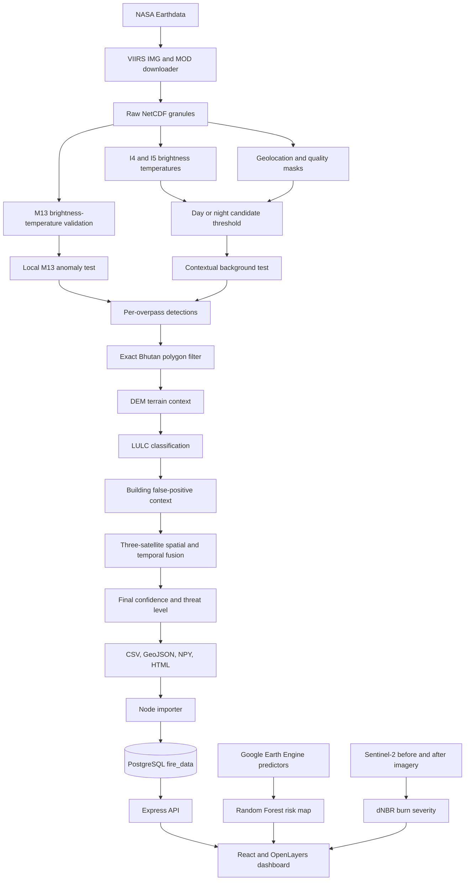

# Bhutan Fire Detection Project: Detailed Technical Workflow

This document explains how the complete workspace operates as implemented in
the source code. It separates the current VIIRS I-band detector from older
experimental detectors so their thresholds and outputs are not confused.

## 1. System Purpose

The project combines five related capabilities:

1. Download raw VIIRS satellite observations over Bhutan.
2. Detect active thermal anomalies using VIIRS I4, I5, and M13 data.
3. Add terrain, land-cover, building, satellite-fusion, confidence, and threat
   context to each detection.
4. Store selected detections in PostgreSQL and display them in a React map.
5. Generate separate Google Earth Engine fire-risk and burn-severity layers.

The main operational hotspot detector is:

```text
bhutan_viirs_fire_detector/
```

The live automation wrapper is:

```text
scripts/auto_viirs_nrt_fire_detection.py
```

The dashboard is:

```text
ForestFireDashboard-main/
```

The prediction and burn-severity services are:

```text
Prediction/app.py
BurnedSeverity/app.py
```

## 2. End-to-End Architecture



## 3. Runtime Services

| Component | Port | Technology | Role |
|---|---:|---|---|
| PostgreSQL | 5433 on host | Docker, PostgreSQL 15 | Persistent hotspot database |
| Dashboard API | 3000 | Node.js, Express, Sequelize | Queries and imports hotspot records |
| Prediction service | 5000 | Flask, Google Earth Engine | Random Forest fire-risk tiles |
| Burn severity service | 5001 | Flask, Google Earth Engine | Sentinel-2 dNBR tiles |
| Dashboard client | 5173 | React, Vite, OpenLayers | User interface and map |

All services can be started with:

```powershell
.\start_dashboard.ps1
```

The launcher starts Docker, the Node API, both Flask services, and Vite. Logs
are written under `outputs/`.

## 4. Main Data Sources

### 4.1 VIIRS satellites

The current detector supports:

| Satellite | Archive prefix | NRT prefix |
|---|---|---|
| Suomi NPP | VNP | VNP |
| NOAA-20 | VJ1 | VJ1 |
| NOAA-21 | VJ2 | VJ2 |

For every overpass, the downloader requires a complete four-file set with the
same `AYYYYDDD.HHMM` granule timestamp:

| Product role | Suomi NPP example |
|---|---|
| Image-resolution radiance | `VNP02IMG` or `VNP02IMG_NRT` |
| Image-resolution geolocation | `VNP03IMG` or `VNP03IMG_NRT` |
| Moderate-resolution radiance | `VNP02MOD` or `VNP02MOD_NRT` |
| Moderate-resolution geolocation | `VNP03MOD` or `VNP03MOD_NRT` |

The Earthdata search first uses the Bhutan bounding box:

```text
longitude: 88.7 to 92.2
latitude:  26.6 to 28.4
```

The bounding box reduces download and processing work. A precise Bhutan
polygon filter is applied later.

### 4.2 Context datasets

The active detector automatically discovers and uses these real local layers:

```text
bhutan_viirs_fire_detector/data/dem/BHutan_SRTM.tif
bhutan_viirs_fire_detector/data/lulc/Land Use Land Cover 2020.shp
bhutan_viirs_fire_detector/data/buildings/NCRP Building Footprints.shp
data/boundaries/bhutan_dzong_web.geojson
```

If a context layer is missing, the detector has synthetic or demonstration
fallbacks. Those fallbacks allow code execution but should not be treated as
scientific replacement data.

## 5. VIIRS Data Acquisition

The downloader is:

```text
bhutan_viirs_fire_detector/fetch_viirs_earthdata.py
```

The acquisition procedure is:

1. Read NASA Earthdata credentials from a local `.netrc`-style file.
2. Search each selected satellite and each required product.
3. Extract the timestamp key from Earthdata metadata or file links.
4. Intersect the four product result sets.
5. Keep only timestamps that have IMG data, IMG geolocation, MOD data, and MOD
   geolocation.
6. Download all four files into the satellite folder.

Archive data is normally stored under:

```text
bhutan_viirs_fire_detector/data/viirs/snpp/
bhutan_viirs_fire_detector/data/viirs/noaa20/
bhutan_viirs_fire_detector/data/viirs/noaa21/
```

NRT cycle data is stored under timestamped folders:

```text
bhutan_viirs_fire_detector/data/viirs_nrt/<cycle-id>/<satellite>/
```

## 6. Radiometric Preparation

The main ingestion implementation is:

```text
bhutan_viirs_fire_detector/src/data_ingestion.py
```

### 6.1 Primary image-resolution bands

The current detector reads:

- I04 at approximately 3.74 micrometers as the main high-temperature channel.
- I05 at approximately 11.45 micrometers as the background thermal channel.
- I01, I02, and I03 as daytime reflective context.
- M13 at approximately 4.05 micrometers as an independent thermal validator.

### 6.2 Radiance-to-brightness-temperature conversion

I04, I05, and M13 radiance are converted with Planck's law:

```text
BT = c2 / (lambda * ln((c1 / (L * lambda^5)) + 1))
```

Where:

```text
c1 = 1.191042e8
c2 = 1.4387752e4
L  = spectral radiance in W m-2 sr-1 um-1
```

The wavelengths used in code are:

```text
I04: 3.74 um
I05: 11.45 um
M13: 4.05 um
```

M13 is a moderate-resolution band. The converted M13 array is repeated by a
factor of two in both dimensions to align it approximately with the IMG grid.

### 6.3 Reflectance-like I01-I03 values

I01, I02, and I03 are normalized independently using their valid 2nd and 98th
percentiles:

```text
normalized = clip((value - P2) / (P98 - P2), 0, 1)
```

These values are reflectance-like normalized signals, not a full physical
surface-reflectance correction.

### 6.4 Acquisition time

The loader first tries the median `ev_mid_time` scan time using the TAI93
epoch. If unavailable, it derives UTC time from the filename's
`AYYYYDDD.HHMM` token.

## 7. Preprocessing and Pixel Masks

The fire-mask initialization uses these numeric classes:

| Mask value | Meaning |
|---:|---|
| 0 | Not processed |
| 1 | Residual bowtie pixel |
| 3 | Water |
| 4 | Cloud |
| 5 | Valid land available for testing |
| 7 | Low-confidence fire |
| 8 | Nominal-confidence fire |
| 9 | High-confidence fire |

A pixel is excluded when:

- I4, I5, or M13 is non-finite.
- The VIIRS quality flag has bowtie bit `256`.
- The geolocation land/water class is not one of `[1, 2, 3, 4, 5]`.
- The cloud mask is true.

Important implementation note:

The raw NASA IMG/MOD adapters currently initialize `cloud_mask` to all false.
The masking framework supports clouds, but operational NASA granule loading
does not yet decode a cloud-mask product. Water, invalid radiance, and bowtie
masking are active.

## 8. Day and Night Decision

Day or night is decided once for the whole cropped overpass:

```text
daytime if median solar zenith < 85 degrees
```

This is a scene-level decision rather than a separate decision for every
pixel.

## 9. Initial Thermal Candidate Thresholds

The main thermal difference is:

```text
DeltaT = BT4 - BT5
```

The broad candidate mask uses:

| Condition | BT4 threshold | DeltaT threshold |
|---|---:|---:|
| Day candidate | `BT4 > 325 K` | `DeltaT > 25 K` |
| Day high | `BT4 > 335 K` | `DeltaT > 30 K` |
| Night candidate | `BT4 > 295 K` | `DeltaT > 10 K` |
| Night high | `BT4 > 300 K` | `DeltaT > 10 K` |

I4 is treated as saturated when:

```text
BT4 >= 366 K
```

This comes from a nominal saturation value of `367 K` with a `1 K` margin.
A saturated pixel is promoted to the absolute high class only when M13 also
confirms it.

## 10. Adaptive Local Background Test

For every broad candidate, the detector searches for a valid local background.

1. Start with an `11 x 11` window.
2. Expand through odd sizes `13 x 13`, `15 x 15`, and so on.
3. Stop at a maximum `35 x 35` window.
4. Require at least 25 valid background pixels.
5. Exclude the center candidate from background statistics.

For BT4, BT5, DeltaT, and M13, the code calculates:

```text
mean = arithmetic mean of valid local background values
MAD  = mean(abs(value - mean))
```

The contextual adaptive threshold is:

```text
adaptive_delta =
    mean_background_delta
    + 2.0 * MAD_background_delta * seasonal_factor
```

For daytime candidates, a second floor is required:

```text
day_absolute_delta =
    mean_background_delta
    + 10 K * seasonal_factor
```

Contextual pass rules:

```text
Day:
    DeltaT > adaptive_delta
    AND
    DeltaT > day_absolute_delta

Night:
    DeltaT > adaptive_delta
```

### 10.1 Seasonal factors

The seasonal multiplier changes contextual sensitivity:

| Months | Bhutan season interpretation | Factor |
|---|---|---:|
| December-February | Winter/dry | 0.90 |
| March-May | Spring fire season | 0.85 |
| June-September | Monsoon | 1.15 |
| October-November | Post-monsoon | 1.00 |

A factor below 1 lowers the contextual threshold and increases sensitivity.
A factor above 1 raises the threshold.

## 11. M13 Validation

M13 is tested against the same local background:

```text
M13_anomaly = pixel_M13 - mean_background_M13
```

M13 confirms a candidate when:

```text
M13_anomaly > 2.0 * MAD_background_M13
```

If the local M13 MAD is zero or invalid, M13 confirmation is false.

## 12. Bright-Surface and Sun-Glint Checks

### 12.1 Bright daytime surface flag

A daytime candidate receives the bright-surface flag when:

```text
I3 > 0.30
I3 > I2
I2 > 0.25
BT4 <= 335 K
```

Despite the function name `bright_surface_rejection`, the current code does
not hard-reject the pixel. It applies an 18-point confidence penalty.

### 12.2 Sun-glint risk

Glint risk is approximated from solar zenith, view zenith, and relative
azimuth:

```text
azimuth_term = max(0, 1 - abs(relative_azimuth) / 60)
zenith_term  = max(0, 1 - abs(solar_zenith - view_zenith) / 35)
glint_risk   = clip(azimuth_term * zenith_term, 0, 1)
```

The thermal confidence loses up to 8 points:

```text
glint penalty = 8 * glint_risk
```

## 13. Current Candidate Acceptance Behavior

The implementation first builds the candidate mask using the day/night
candidate thresholds in Section 9. It then calls the absolute classification
using the same candidate thresholds.

Therefore, a pixel that reaches the detailed testing loop already receives at
least the absolute `"candidate"` class. In the current code:

- The broad I4/I5 candidate threshold is effectively the acceptance gate.
- Contextual and M13 tests mainly change confidence.
- M13 is required to promote a saturated pixel directly to the high class.
- Bright-surface and glint tests reduce confidence but do not hard-reject.
- A candidate is skipped if no background window with 25 valid pixels exists.

This behavior is important when interpreting the outputs. The implementation
is inspired by VIIRS active-fire logic, but it is not the official NASA VNP14
algorithm.

## 14. Per-Overpass Thermal Confidence

The detector starts at 35 points and adds weighted evidence:

```text
thermal_confidence =
    35
    + 25 * normalize(BT4, 295 K, 367 K)
    + 20 * normalize(DeltaT, 8 K, 35 K)
    + M13 contribution
    + contextual contribution
    + saturation contribution
    - bright-surface penalty
    - glint penalty
```

Exact contributions:

| Evidence | Score change |
|---|---:|
| M13 confirmed | `+15` |
| M13 not confirmed | `-8` |
| Contextual test passed | `+12` |
| Contextual test failed | `-5` |
| I4 saturated | `+8` |
| Bright-surface flag | `-18` |
| Glint | `-8 * glint_risk` |

The result is clipped to `1-99`.

Absolute class minimums are then applied:

```text
high class      -> confidence at least 85
candidate class -> confidence at least 55
```

The per-overpass mask class is:

| Confidence | Fire-mask class |
|---:|---:|
| `>= 85` | 9, high confidence |
| `>= 65` | 8, nominal confidence |
| `< 65` | 7, low confidence |

The contextual confidence field is:

```text
90 if contextual test passed
40 if contextual test failed
```

## 15. Exact Bhutan Boundary Filter

The VIIRS swath is initially cropped with a rectangular bounding box for
speed. After thermal detection, point detections are filtered with the actual
Bhutan polygon using `covers`.

This is the authoritative country filter. It removes candidate pixels from
nearby India or Tibet that are inside the search rectangle but outside Bhutan.

## 16. Terrain Context

Terrain processing samples the Bhutan DEM around every detection.

### 16.1 DEM sampling

- Reproject the WGS84 detection coordinate to the DEM CRS.
- Read elevation at the detection point.
- Read a local `5 x 5` DEM window.
- Calculate slope and aspect from elevation gradients.

Slope:

```text
slope = degrees(atan(sqrt((dz/dx)^2 + (dz/dy)^2)))
```

Aspect:

```text
aspect = degrees(atan2(-dz/dx, dz/dy)) normalized to 0-360
```

### 16.2 Terrain illumination

The code approximates solar azimuth and elevation from time and location, then
calculates terrain-sun incidence angle.

Terrain labels:

| Condition | Factor | False-positive risk |
|---|---:|---|
| Night | 1.00 | Low |
| Day, slope `> 28 deg`, incidence `< 45 deg` | 1.12 | High |
| Incidence `> 100 deg` | 0.94 | Low |
| Other daytime terrain | 1.00 | Moderate |

The factor is exported as metadata. The current final-confidence formula uses
the high-risk label as an 8-point penalty; it does not multiply BT4 or DeltaT
by the factor.

## 17. Land-Use/Land-Cover Classification

Detections are spatially joined to the 2020 Bhutan LULC polygons. Source class
names are normalized into:

```text
water
agriculture
forest
built-up
shrub/grassland
barren/rocky
unknown
```

The first-pass fire context is:

| LULC class | Fire context |
|---|---|
| Water | `water_false_positive` |
| Agriculture/crop/paddy | `agricultural_burning` |
| Forest | `forest_fire` |
| Built-up | `possible_roof_false_positive` |
| Shrub/meadow/grass/alpine | `vegetation_fire` |
| Rock/moraine/landslide/snow/glacier | `unknown_thermal_anomaly` |
| Unrecognized | `unknown_thermal_anomaly` |

This is contextual classification, not a separate machine-learning model.

## 18. Building and Roof False-Positive Analysis

Building footprints are projected to EPSG:3857 for distance calculations.
For every detection, the code records:

- Whether the point overlaps a building polygon.
- Distance to the nearest building.
- Counts of buildings within 500 m, 1 km, and 2 km.
- A roof false-positive score.
- A structure-fire probability.

### 18.1 Roof false-positive score

```text
+0.45 if the point overlaps a building
+0.30 if M13 is not confirmed
+0.25 if thermal confidence < 65
+0.10 if more than 8 buildings are within 500 m
```

The score is clipped to `0-1`.

### 18.2 Structure-fire probability

```text
+0.45 if building overlap and M13 is confirmed
+0.30 if thermal confidence > 80
+0.20 if nearest building is within 100 m
```

The probability is clipped to `0-1`.

### 18.3 Context refinement

The context is updated in this order:

1. Building overlap and roof score `>= 0.75`:
   `roof_false_positive`.
2. Building overlap and no M13 confirmation:
   `possible_roof_false_positive`.
3. Building overlap and either M13 confirmation or structure probability
   `>= 0.55`: `structure_fire_candidate`.
4. Otherwise retain the LULC-based context.

## 19. Multi-Satellite Fusion

Detections from SNPP, NOAA-20, and NOAA-21 are fused using:

```text
spatial tolerance: 375 m
temporal tolerance: 3 hours
```

The records are sorted by acquisition time. Starting from each unused
detection, the code groups unused detections that are within 375 m and within
3 hours of that seed detection.

The group stores:

- Unique satellite names.
- Number of satellites.
- First and last detection time.
- Persistence in minutes.
- The row with the highest thermal confidence as the representative row.

Temporal confidence is:

```text
temporal_confidence =
    min(
        100,
        35
        + 25 * number_of_unique_satellites
        + min(20, persistence_minutes / 3)
    )
```

Examples with zero persistence:

| Satellites | Temporal confidence |
|---:|---:|
| 1 | 60 |
| 2 | 85 |
| 3 | 100 |

The grouping is a greedy seed-based fusion, not DBSCAN and not a transitive
connected-component algorithm.

## 20. Final Confidence Score

After context and fusion, the final score is:

```text
final_confidence =
    0.42 * thermal_confidence
    + 0.18 * contextual_confidence
    + 0.22 * temporal_confidence
    + M13 adjustment
    + terrain adjustment
    + roof adjustment
    + structure adjustment
    + LULC context adjustment
```

Exact adjustments:

| Evidence | Score change |
|---|---:|
| M13 confirmed | `+10` |
| M13 not confirmed | `-8` |
| High terrain false-positive risk | `-8` |
| Roof score | `-25 * roof_false_positive_score` |
| Structure probability | `+20 * structure_fire_probability` |
| Forest context | `+5` |
| Roof or water false positive | `-35` |
| Agricultural burning | `-4` |

The final score is clipped to `1-99` and mapped again to mask classes 7, 8,
or 9 using the 65 and 85 thresholds.

## 21. Threat-Level Classification

False-positive contexts receive:

```text
No Alert
```

These contexts are:

```text
roof_false_positive
possible_roof_false_positive
water_false_positive
```

A detection is considered confirmed when:

```text
final confidence >= 85
OR
number of satellites >= 2
```

Threat rules are applied in order:

| Rule | Threat |
|---|---|
| Confirmed and nearest building `<= 100 m` | Instant Alert |
| Confirmed and nearest building `<= 500 m` | High Risk |
| Confirmed and nearest building `<= 1000 m` | Warning |
| Forest fire and nearest building `<= 500 m` | High Risk |
| Agricultural burning farther than 1000 m | Monitor |
| Any remaining accepted detection | Monitor |

## 22. Detector Outputs

The primary detector writes:

```text
fire_mask.npy
fire_detections.csv
fire_detections.geojson
fire_map.html
```

The CSV and GeoJSON include:

- Coordinates and fused satellite sources.
- First/last detection times and persistence.
- BT4, BT5, DeltaT, M13, and M13 anomaly.
- Contextual and saturation flags.
- Terrain values.
- LULC and fire context.
- Building distance and density.
- Roof and structure scores.
- Thermal, temporal, and final confidence.
- Final mask class and threat level.

The live NRT output folder is:

```text
outputs/viirs_nrt/
```

The current filenames are:

```text
outputs/viirs_nrt/fire_detections.csv
outputs/viirs_nrt/fire_detections.geojson
outputs/viirs_nrt/fire_mask.npy
outputs/viirs_nrt/fire_map.html
```

Compatibility copies are also maintained:

```text
outputs/viirs_nrt/viirs_nrt_hotspots.csv
outputs/viirs_nrt/viirs_nrt_hotspots.geojson
outputs/viirs_nrt/viirs_nrt_clusters.geojson
```

## 23. Historical Detection Workflow

An archive run uses:

```powershell
python bhutan_viirs_fire_detector\fetch_viirs_earthdata.py `
  --mode archive `
  --start 2023-04-08 `
  --end 2023-04-09 `
  --sensors snpp,noaa20,noaa21
```

Then:

```powershell
python bhutan_viirs_fire_detector\main.py `
  --real `
  --max-observations 100 `
  --out-dir outputs_true_i_band_apr8_9
```

The detector prefers complete IMG/MOD sets. If no IMG sets exist and fallback
is allowed, it can use MOD-only proxies:

- M13 converted with the 4.05 um Planck calculation as a BT4 proxy.
- M15 converted with the 10.76 um Planck calculation as a BT5 proxy.
- M05, M07, and M10 normalized as I1, I2, and I3 proxies.

The MOD-only fallback is lower fidelity and should be identified as a proxy
run, not a true 375 m I-band run.

## 24. Live NRT Automation

The automation script is:

```text
scripts/auto_viirs_nrt_fire_detection.py
```

Default settings:

```text
interval:         15 minutes
lookback window:  6 hours
maximum granules: 80 per product search
sensors:          SNPP, NOAA-20, NOAA-21
mode:             NRT
```

Each cycle:

1. Calculate the UTC search window.
2. Create a timestamped raw-data folder.
3. Download complete NRT IMG/MOD sets.
4. Discover complete four-file granule sets.
5. Compare granule keys with `processed_granules.json`.
6. Run the main true I-band detector.
7. Write `fire_detections.csv` and GeoJSON.
8. Copy outputs to compatibility filenames.
9. Update cycle status and processed-granule state.
10. Optionally import the CSV into PostgreSQL.
11. Sleep until the next cycle.

If fetching fails, no complete sets are found, or detection fails, the script
writes empty output files so an older result is not presented as a fresh NRT
result.

Continuous execution with database import:

```powershell
python scripts\auto_viirs_nrt_fire_detection.py `
  --interval-minutes 15 `
  --lookback-hours 24 `
  --max-granules 200 `
  --dashboard-import
```

The state file is:

```text
outputs/viirs_nrt/processed_granules.json
```

## 25. PostgreSQL Import and Storage

The NRT importer is:

```text
ForestFireDashboard-main/server/scripts/importCustomViirsOutput.js
```

It reads the hotspot CSV and maps fields as follows:

| Detector field | Database field |
|---|---|
| `latitude` | `latitude` |
| `longitude` | `longitude` |
| `BT4` | `brightness` |
| First or last fused time | `acq_date`, `acq_time` |
| `satellite_sources` | `satellite` |
| Constant | `instrument = VIIRS_375M_I_BAND` |
| NRT import | `version = BHUTAN_TRUE_I_BAND_NRT` |
| Historical import | `version = BHUTAN_TRUE_I_BAND` |
| `final_confidence_score` | `confidence` |
| `M13_anomaly` | `frp` |
| `final_context_class` | `fire_type` |

Important naming note:

For custom true-I-band records, the database `frp` field stores the M13 anomaly,
not a physically calculated Fire Radiative Power value.

The database is:

```text
database: forestfire
table:    fire_data
```

The Docker service is named:

```text
forest_fire_db
```

PostgreSQL files are persisted in the Docker named volume:

```text
postgres_data
```

Inside the container, the volume is mounted at:

```text
/var/lib/postgresql/data
```

Stopping or recreating the container does not delete the named volume unless
the volume is explicitly removed.

### 25.1 Duplicate rule

The database has a unique index on:

```text
latitude, longitude, acq_date, acq_time
```

Imports use `ignoreDuplicates`. A record with the same coordinate, date, and
time as an existing record is skipped even if another field differs.

## 26. Dashboard API

The Express API serves:

```text
GET  /health
GET  /api/fire-data
GET  /api/fire-data/pipeline-status
GET  /api/fire-data/statistics
GET  /api/fire-data/hottest-month
GET  /api/fire-data/fetch-latest
GET  /api/fire-data/latest
POST /api/fire-data/run-viirs
```

The main fire-data query supports:

```text
start=YYYY-MM-DD
end=YYYY-MM-DD
source=true_i_band|live_nrt|legacy_custom|dashboard_viirs|all
```

Current source filters:

| Dashboard source | Database version |
|---|---|
| VIIRS Detection (3 satellites) | `BHUTAN_TRUE_I_BAND` |
| Live NRT automation | `BHUTAN_TRUE_I_BAND_NRT` |

Queries are ordered newest first and limited to 10,000 records.

The Node server also independently requests NASA FIRMS
`VIIRS_SNPP_NRT` data every 15 minutes. Those official FIRMS records can be
stored in the same table, but the two current dashboard source choices filter
specifically for the custom true-I-band version labels.

The `POST /run-viirs` route launches the older M13-percentile detector, not the
current I4/I5 detector. It is retained as a legacy API path.

## 27. React and OpenLayers Dashboard

The client:

1. Selects a historical or live source.
2. Sends start/end dates to the Express API.
3. Applies an additional buffered Bhutan rectangle filter in the browser.
4. Converts database rows into OpenLayers point features.
5. Colors points by `fire_type`.
6. Sizes markers slightly larger when confidence is at least 90.
7. Displays Bhutan and dzongkhag boundaries.
8. Refreshes fire data every 60 seconds.

The browser buffer uses:

```text
base bounds: 88.5-92.5 E, 26.5-28.5 N
buffer:      approximately 10 km
```

Selecting a dzongkhag highlights and zooms to its polygon. It does not remove
markers from other dzongkhags.

The NRT pipeline is shown as:

```text
active:      latest output age <= 45 minutes
stale:       latest output age > 45 minutes
not started: no NRT output timestamp
```

### 27.1 Dashboard popup interpretation

For custom true-I-band rows:

```text
Brightness  = BT4
M13 anomaly = database frp field
Confidence  = rounded final confidence
```

The popup intensity labels use the M13 anomaly value:

| M13 anomaly | UI intensity |
|---:|---|
| `< 10` | Low |
| `10-29.99` | Moderate |
| `30-59.99` | High |
| `>= 60` | Extreme |

These are display categories, not calibrated FRP classes.

## 28. Predicted Fire-Risk Map

The prediction service is:

```text
Prediction/app.py
```

It is separate from the hotspot detector and PostgreSQL. It does not use the
detected hotspot CSV or database rows as runtime predictors.

### 28.1 Google Earth Engine assets

```text
AOI:
projects/ee-05220053jnec/assets/BHUTAN_WGS84

Training points:
projects/ee-05220053jnec/assets/TS_Balanced_5k
```

Training points are randomly split:

```text
70% training
30% testing
```

The 30% test subset is created but is not currently used to calculate an
accuracy matrix, precision, recall, F1 score, or validation report.

### 28.2 Predictor variables

Terrain:

```text
SRTM elevation
slope
aspect
hillshade
Laplacian-8 curvature
```

Weather:

```text
Mean CHIRPS daily precipitation over selected dates
Mean daytime GCOM-C LST over selected dates
```

GCOM-C temperature conversion:

```text
temperature_C = LST_AVE * 0.02 - 273.15
```

Landsat:

```text
Landsat 8 and Landsat 9 Collection 2 Level 2
date window = selected start - 30 days to selected end + 30 days
scene cloud cover < 70%
median composite
```

Indices:

```text
NDVI = (B5 - B4) / (B5 + B4)
NDMI = (B5 - B6) / (B5 + B6)
NBR  = (B5 - B7) / (B5 + B7)

BSI =
    ((B6 + B4) - (B5 + B2))
    /
    ((B6 + B4) + (B5 + B2) + 14545.45)
```

All predictor bands are stacked and `unmask(0)` is applied.

Current Landsat implementation notes:

- It filters by scene-level cloud cover but does not apply a per-pixel QA cloud
  mask.
- It does not explicitly apply Landsat Collection 2 surface-reflectance scale
  and offset factors before index calculation.
- If no Landsat scenes exist, zero-valued fallback bands are used.
- If no rainfall exists, rainfall defaults to zero.
- If no GCOM-C LST exists, temperature defaults to 20 C.

### 28.3 Classification method

The classifier is:

```text
Google Earth Engine smileRandomForest
number of trees: 100
training property: value
sampling scale: 30 m
tileScale: 16
```

The model is retrained each time `/generate_map` is requested.

The output is a class map clipped to Bhutan and visualized from 0 to 1:

```text
0 -> green
1 -> red
```

The implemented model is binary. The dashboard legend shows low, medium, and
high colors, but the Earth Engine classifier does not currently produce a
separate medium-risk class or probability surface.

## 29. Burn-Severity Map

The burn-severity service is:

```text
BurnedSeverity/app.py
```

It creates a Google Earth Engine tile layer dynamically. It does not read the
local `dNBR_bhutan.tif` file and does not use PostgreSQL hotspot records.

### 29.1 Sentinel-2 preprocessing

Dataset:

```text
COPERNICUS/S2_SR_HARMONIZED
```

Cloud masking uses QA60:

```text
bit 10 = cloud
bit 11 = cirrus
```

Pixels are kept only when both bits are zero. Reflectance is divided by
10,000.

For each period, the service builds a median composite.

### 29.2 Before and after periods

For dashboard dates `before` and `after`:

```text
pre-fire period:
    before date minus 2 months
    through the before date

post-fire period:
    after date
    through after date plus 2 months
```

### 29.3 NBR and dNBR

Sentinel-2 NBR:

```text
NBR = (B8 - B12) / (B8 + B12)
```

Burn change:

```text
dNBR = pre_fire_NBR - post_fire_NBR
```

The map is visualized continuously:

```text
minimum: -1
maximum:  1
palette: blue, green, yellow, orange, red
```

The current backend does not apply discrete dNBR threshold classes. The UI
labels the palette as enhanced regrowth, unburned/low change, low severity,
moderate severity, and high severity, but these are visual palette labels
rather than explicit numeric class intervals.

## 30. Legacy M13 Percentile Detector

The older detector is:

```text
scripts/fetch_and_detect_bhutan_viirs.py
```

It uses only moderate-resolution VNP02MOD/VNP03MOD data.

For each granule:

1. Read M13 radiance.
2. Keep finite pixels with `0 < M13 < 100`.
3. Apply Bhutan bounding box and exact polygon.
4. Calculate `log(M13)`.
5. Calculate the selected percentile inside Bhutan.
6. Keep pixels at or above the threshold.

Default threshold:

```text
percentile = 99.9
```

Therefore, approximately the hottest 0.1% of valid Bhutan pixels in each
granule are selected.

This is a relative hot-tail detector. It is not the current I4/I5 contextual
detector and is not equivalent to the official NASA active-fire algorithm.

### 30.1 Legacy spatial clustering

The legacy output uses DBSCAN:

```text
epsilon = 0.5 coordinate degrees
minimum samples = 4
```

Coordinates are clustered directly in longitude/latitude degrees. At Bhutan's
latitude, `0.5` degrees represents tens of kilometers, so these clusters are
regional groupings rather than 375 m fire objects.

For each non-noise cluster, the code creates a convex hull. Point or line
hulls are skipped; only polygon hulls are exported.

Legacy outputs:

```text
bhutan_fire_hotspots.csv
bhutan_fire_hotspots.geojson
bhutan_fire_hotspots.shp
bhutan_fire_clusters.geojson
bhutan_fire_clusters.shp
```

## 31. Legacy MODIS and Combined Detector

The MODIS script is:

```text
fetch_and_detect_bhutan_modis.py
```

The combined script is:

```text
fetch_and_detect_bhutan_viirs_modis.py
```

MODIS processing:

1. Read Terra or Aqua Level-1B emissive bands.
2. Prefer MODIS band 21; use band 22 as fallback.
3. Apply radiance scale and offset metadata.
4. Keep positive finite pixels inside Bhutan.
5. Calculate log radiance.
6. Select the per-granule 99.9th percentile by default.
7. Cluster selected points with DBSCAN using `eps=0.5`, `min_samples=4`.

The combined script applies the same percentile method separately to:

```text
VIIRS M13
MODIS Terra band 21/22
MODIS Aqua band 21/22
```

These scripts are exploratory comparison pipelines and are not the current
dashboard's primary true-I-band source.

## 32. Earlier Prototype Detector

The folder:

```text
bhutan_fire_detector/
```

contains an earlier dataframe-based prototype. It is not the current NRT
dashboard detector.

Its main defaults are:

```text
absolute I4 threshold: 310 K
I4 anomaly multiplier: 3.0 sigma
M13 anomaly multiplier: 2.5 sigma
fusion distance: 750 m
fusion window: 3 hours
multi-satellite confidence bonus: 0.20
```

It calculates rolling backgrounds by rounded `0.01` degree grid cells, uses up
to 40 observations with a minimum of 8, applies seasonal and terrain
multipliers, and classifies:

```text
Anomaly
Probable Fire
Confirmed Fire
```

This prototype remains useful for comparison but should not be mixed with the
current `bhutan_viirs_fire_detector` thresholds.

## 33. Key Storage Locations

```text
Raw historical VIIRS:
bhutan_viirs_fire_detector/data/viirs/

Raw NRT VIIRS:
bhutan_viirs_fire_detector/data/viirs_nrt/

Latest NRT hotspot files:
outputs/viirs_nrt/

Historical detector outputs:
bhutan_viirs_fire_detector/outputs*

Legacy VIIRS outputs:
outputs/bhutan/
outputs/dashboard_viirs_queries/

Legacy MODIS outputs:
outputs_bhutan_modis/

Dashboard database:
Docker volume postgres_data
PostgreSQL database forestfire
Table fire_data

Dashboard logs:
outputs/dashboard_*.log

Prediction logs:
outputs/prediction_server*.log

Burn severity logs:
outputs/burn_severity_server*.log
```

## 34. Important Interpretation Limits

1. The current detector is a custom research implementation inspired by VIIRS
   active-fire methods; it is not the official NASA VNP14/VJ114/VJ214 product.
2. The broad I4/I5 candidate threshold is currently the effective acceptance
   gate. Contextual and M13 tests primarily modify confidence.
3. Operational raw granule loading does not yet decode a real VIIRS cloud-mask
   product.
4. The M13 array is aligned to the IMG grid by simple 2x repetition rather
   than geospatial resampling.
5. Reflective I-band values are percentile-normalized, not fully calibrated
   surface reflectance.
6. Terrain, LULC, and building layers add context after thermal detection;
   they do not create thermal detections.
7. Database `frp` contains M13 anomaly for custom detections, not physical FRP.
8. The risk model has a 70/30 split but currently reports no test accuracy.
9. The risk model is binary even though the UI displays a medium-risk legend.
10. Burn severity is a continuous dNBR visualization without numeric severity
    class thresholds.
11. Risk and burn-severity layers are generated independently from the hotspot
    database.
12. Legacy percentile and DBSCAN outputs should not be interpreted as the
    current true-I-band algorithm.

## 35. Main Source Files

```text
Current VIIRS acquisition:
bhutan_viirs_fire_detector/fetch_viirs_earthdata.py

Current detector entrypoint:
bhutan_viirs_fire_detector/main.py

Data loading and calibration:
bhutan_viirs_fire_detector/src/data_ingestion.py

Preprocessing masks:
bhutan_viirs_fire_detector/src/preprocessing.py

Thermal detection:
bhutan_viirs_fire_detector/src/fire_detection.py

Local contextual tests:
bhutan_viirs_fire_detector/src/contextual_tests.py

M13 validation:
bhutan_viirs_fire_detector/src/m13_validation.py

Seasonal adjustment:
bhutan_viirs_fire_detector/src/seasonal_threshold.py

Terrain:
bhutan_viirs_fire_detector/src/terrain_correction.py

LULC:
bhutan_viirs_fire_detector/src/lulc_filter.py

Buildings:
bhutan_viirs_fire_detector/src/building_filter.py

Satellite fusion:
bhutan_viirs_fire_detector/src/sensor_fusion.py

Threat levels:
bhutan_viirs_fire_detector/src/proximity_risk.py

NRT automation:
scripts/auto_viirs_nrt_fire_detection.py

Database importer:
ForestFireDashboard-main/server/scripts/importCustomViirsOutput.js

Database model:
ForestFireDashboard-main/server/models/FireData.js

Dashboard API:
ForestFireDashboard-main/server/controllers/fireDataController.js

Dashboard map:
ForestFireDashboard-main/client/src/components/FireMap.jsx

Risk prediction:
Prediction/app.py

Burn severity:
BurnedSeverity/app.py
```
